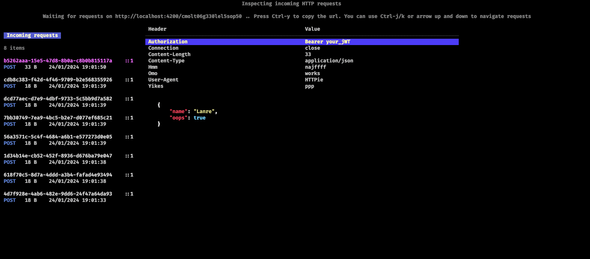

# Sdump

An opensource HTTP request bin built over SSH

Sdump is a HTTP request bin built over SSH. I usually have to google for some
3rd party server or download a binary to inspect certain requests.

Inspect, test and debug any request or webhook from your terminal



## Why?

There is always a new flavor of an online HTTP request bin i have to use every other
month. Or sometimes, people have to download Ngrok to get a request bin
functionality i.e people have to download or use external services to
get a request bin.

I spend an awful amount of time in the terminal and it makes sense i should
be able to spin up and use a request bin on my terminal. Hence this
project sdump

SSH can normally forward local and remote ports. This service implements an
SSH server that only handles forwarding and nothing else.
The service supports multiplexing connections over HTTP/HTTPS with WebSocket
support. Just assign a remote port as port 80 to proxy HTTP traffic and 443
to proxy HTTPS traffic. If you use any other remote port, the server will
listen to the port for TCP connections, but only if that port is available.

### How to use

```sh
ssh ssh.sdump.app
```

### Commands

- `ctrl + y`: Copies the generated url you can use to debug
HTTP requests
- `ctrl + b`: Copies the JSON request body of the current request
you are viewing

### Developers' note

Use `ssh-keygen -f .ssh/id_rsa` to generate a test ssh key
